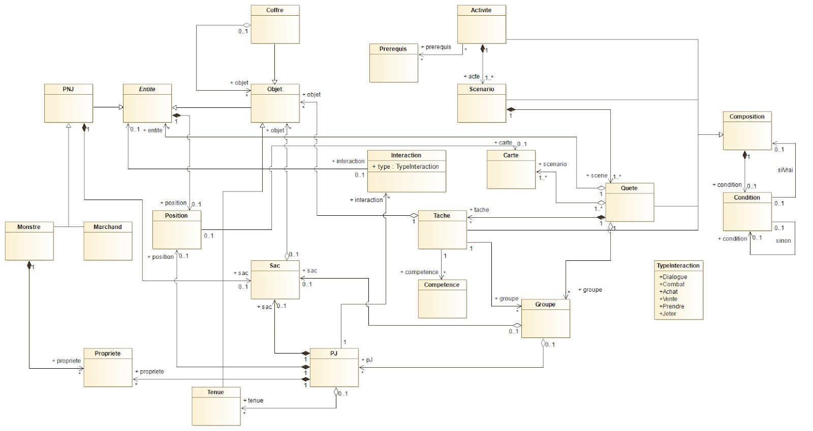

# GENERATEUR DE SCENARIO DE JEU SERIEU

### Fonctionnement de l'outil:

Le projet fonctionne avec npm.

Pour le lancement du projet pour la première faire npm update, ensuite npm start.

### Techno utilisé:
    Le langage utilisé : React js
    Affichage du graphe : react-d3-graph
    Affichage de l'explorateur à gauche : Tree-view

### INTRODUCTION
#

Le domaine de recherche de notre client se porte sur les jeux sérieux.
Chaque scénario est conçu manuellement sur dans des fichiers JSON grâce à un éditeur de texte.
Problème : Long, fastidieux, complexe, pas de vue globale sur le scénario.

Le but était donc de proposer une interface simple, que tout le monde puisse manipuler.
Grâce à cet outil notre client peut :
 * Travailler sur plusieurs scénarios. 
 * Avoir un formalisme imposé avec une visualisation graphique de notre création.

### CHOIX MODELISATION (UML)
#

#
### ABSTRACTION
**Une activité** est un ensemble de **scénarios**, eux-mêmes ensembles de **quêtes**.
Chaque **quête** a lieu dans un ensemble de cartes, dans lesquelles le **PJ** peut se balader.
Chaque **quête** est un ensemble de **tâches** à réaliser. 

La classe **Condition** gère les transitions entre les **scénarios**, les **quêtes** et les **tâches**.
Par analogie, ce serait le contrôleur de l’application.

Un **PJ** peut interagir avec une entité, que ce soit un objet, un marchand, un monstre.

Un **PNJ** possède un sac. Cela permettra au “marchand” de vendre un nombre non défini d’objets, mais également de faciliter l’implémentation du “drop” lorsqu’un “monstre” est vaincu”.

#
### POUR des eventuelles évolutions du projet
Un joueur possède un ensemble de propriétés, de même pour un PNJ “monstre”.
Ces propriétés peuvent servir pour un combat, mais également pour des quiz ou autres jeux.
Elles peuvent être également utilisées pour stocker les informations d’un joueur.

En s’inspirant du concept de l’application ITAC, nous avons observé qu’un groupe de joueurs pouvait avoir un sac en commun, mais qui pouvait être défini comme étant une carte (sur laquelle on manipule des éléments), et que chaque joueur pouvait posséder un sac qui lui est propre.
Par ailleurs, cette application utilise des “objets” que l’on peut modifier.

